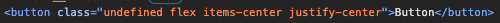
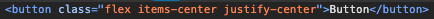

## Tailwind의 문제점

컴포넌트의 유연함을 위해 className을 다음처럼 optional하게 받아오는 경우가 정말 많다.

```
const Button = ({ text, className }: { text: string; className?: string }) => (*
  <button className={`${className} flex items-center justify-center`}>
    {text}
  </button>
);
```

하지만 className이 undefined이면 개발자 도구에서 `class="undefined"`로 포함된다는 것을 알게 되었다.  
이를 해결하기 위해 일반적으로 cn이라는 유틸 함수를 만들어 쓰는 것으로 보인다.


## cn

cn은 classNames의 약자이며 주로 다음과 같이 작성한다.

```
//cn.ts
import { ClassValue, clsx } from 'clsx';
import { twMerge } from 'tailwind-merge';

export function cn(...inputs: ClassValue[]) {
  return twMerge(clsx(inputs));
}
```

이를 이용하면 위 Button 코드를 다음과 같이 작성할 수 있으며, falsy한 값은 className에 포함되지 않는다.

```
const Button = ({ text, className }: { text: string; className?: string }) => (
  <button className={cn('flex items-center justify-center', className)}>
    {text}
  </button>
);
```



다음으로 cn을 구성하는 clsx, twMerge 함수에 대해 알아보자.

### clsx

clsx는 조건부로 클래스를 결합하는 함수로, 다음과 같은 기능들을 제공한다.

- **단순 클래스 결합**: 조건부로 클래스를 결합하는 기능만 제공
- **다양한 입력 지원**: 문자열, 객체, 배열 등 다양한 형태의 입력을 처리
- **falsy 값 처리**: false, null, undefined 등의 falsy 값을 자동으로 제거

```
clsx('px-4 py-2', isActive && 'bg-blue-500', !isActive && 'bg-gray-500');
```

하지만 중복되는 tailwind 클래스에 대한 처리는 하지 못한다.

```
clsx('p-4', 'p-6', 'p-4');
// => 'p-4 p-6 p-4'
```

### twMerge

twMerge는 중복되는 tailwind 클래스가 있을 경우 마지막에 선언된 클래스를 우선 적용한다.

```
twMerge('p-4 p-2', 'p-8');
// => 'p-8'
```

이를 통해 충돌하는 클래스를 처리할 수 있다.

```
twMerge('text-red-500 text-lg', 'text-blue-500');
// => 'text-lg text-blue-500'
```
