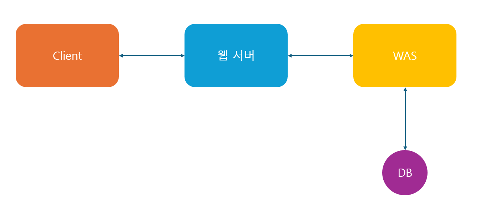

## Web Server

클라이언트는 **웹 서버**에게 URL(주소)를 가지고 HTTP(통신 규칙)에 맞게 요청하면 알맞은 HTML(내용)을 응답 받을 수 있다.

<!-- truncate -->

### Web

인터넷 기반 정보 공유 및 검색 서비스를 의미한다. 사용자는 브라우저를 통해 웹 서버에 요청을 보내고, 서버로부터 정보를 받아볼 수 있다.

### Server

클라이언트에게 네트워크를 통해 정보나 서비스를 제공하는 컴퓨터 시스템이다. 웹 서버와 WAS도 이러한 서버의 한 종류로, 각각의 역할에 따라 구분된다.

### 역할

- 클라이언트로부터 HTTP 요청을 받아 HTML, CSS, 이미지 등의 **정적인 데이터**를 응답
- 요청받은 URL에 해당하는 **파일을 찾아 그대로 전달**하는 단순한 역할을 수행

:::danger
자바스크립트도 정적인 데이터로 간주되어 전달되며, **클라이언트**에서 실행된다..
:::

### 한계

> **정적인 데이터만** 제공할 수 있다는 한계가 있다.

마이페이지와 같이 사용자마다 다른 데이터를 보여줘야 하는 경우, 웹 서버는 이를 처리할 수 없다.  
모든 사용자의 페이지를 미리 만들어 둘 수 없기 때문이다.

## 웹 애플리케이션 서버(WAS)

### 정의

WAS(Web Application Server)는 웹 애플리케이션을 실행하고 동적인 기능을 제공하는 소프트웨어 프레임워크다. 웹 서버가 처리하지 못하는 **복잡한 작업**을 토스 받아 대신 수행하여 그 결과를 웹 서버에 전달한다.

:::tip
Web Application : 웹에서 실행되는 응용 프로그램으로, HTML의 한계를 극복했다.
:::

### 주요 특징

- 동적 페이지 생성  
  PHP, JSP, ASP 등의 언어를 사용해 동적인 웹 페이지를 생성

- 프로그램 실행 환경 제공  
  웹 애플리케이션이 실행될 수 있는 환경을 제공

- DB와의 연동  
  데이터베이스에 접근하여 필요한 데이터를 조회하거나 저장

- 비즈니스 로직 수행  
  로그인, 결제 처리 등과 같은 복잡한 비즈니스 로직을 처리

## 동작 방식

웹 서버가 클라이언트 요청 중 복잡한 작업(예: 로그인)을 WAS로 전달합니다.  
WAS는 DB와 연동하여 필요한 데이터를 가져오고, 이를 기반으로 동적인 페이지를 생성합니다.  
생성된 결과를 다시 웹 서버에 전달하고, 최종적으로 클라이언트에게 응답합니다.

## 참고

https://helloworld-88.tistory.com/71  
https://www.youtube.com/watch?v=70bzGTx-BHo
