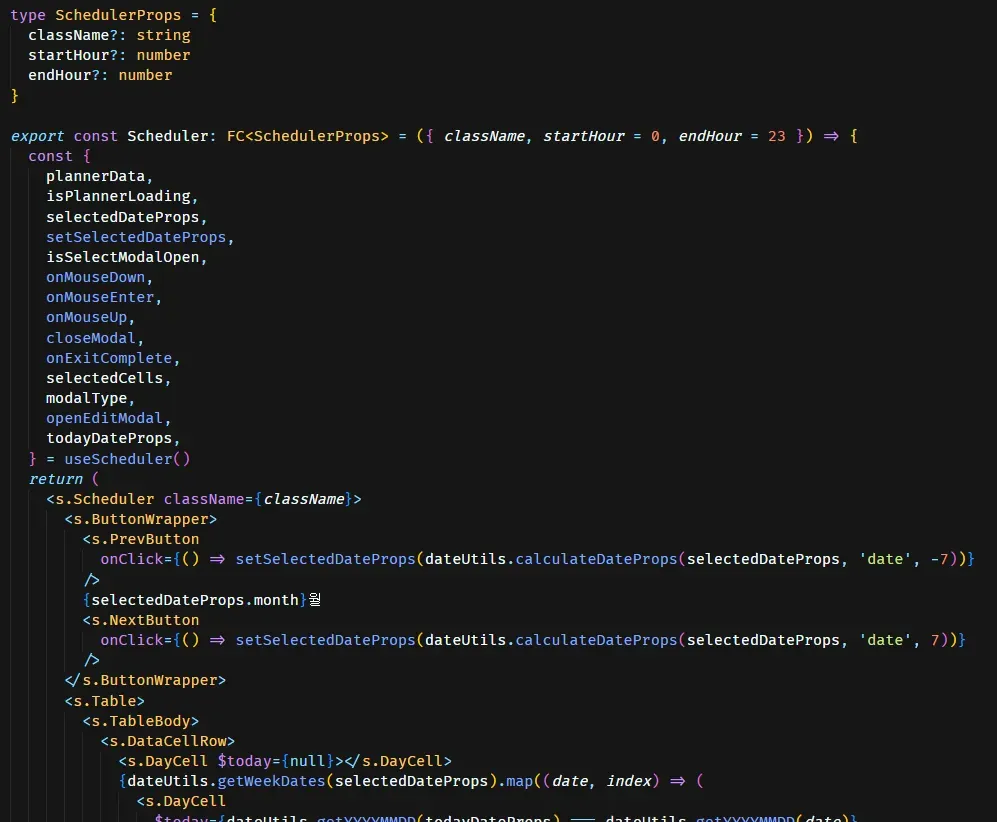

## 📎 Github

https://github.com/shlee9999/PlanMate

## **✨ 프로젝트 개요**

PlanMate는 전문직 준비생들을 위한 학습 관리 및 커뮤니티 플랫폼입니다. 사용자가 효율적으로 학습 시간을 관리하고, 학습 패턴을 분석하며, 필요한 정보를 공유할 수 있도록 다양한 기능을 제공합니다.

**⏰ 개발 기간**

1차 개발: 2023.05 ~ 2023.08

2차 개발: 2024.01

**👪 팀원 구성**

| **역할**    | **이름** |
| ----------- | -------- |
| 🖥️ FrontEnd | 이성훈   |
| 🛠️ BackEnd  | 김호진   |
| 🎨 디자인   | 박소현   |
| 📝 기획     | 김인서   |

## **🌈 핵심 기능**

### **⏱️타이머 페이지**

- 사용자가 원하는 과목을 CRUD할 수 있습니다.
- 과목별 시간을 측정하고 이를 시각화한 그래프에 즉시 반영하여 사용자에게 성취감을 줍니다.
- 과목에 따라 색깔을 다양하게 지정할 수 있습니다.

### **📊통계 페이지**

- 캘린더를 이용하여 날짜별 통계를 시각화합니다.
- 학습량에 따라 색상을 다르게 표시하여 사용자에게 직관적인 UI를 보여줍니다.
- 차트를 이용해 과목별 학습 시간을 한 눈에 비교할 수 있습니다.
- 그래프를 통해 시간대별로 전 날과 공부량을 비교할 수 있습니다.

다른 세부 기능들은 ReadMe를 참고해주세요.

> https://github.com/shlee9999/PlanMate/blob/master/README.md

## **🛠️ 사용한 기술 스택**

- TypeScript, React, Redux
- styled-components, framer-motion
- draft-js, Chart.js

## 💫 신경 쓴 부분

### 코드의 유지보수성과 확장성

프로젝트를 단독으로 진행하면서도 팀 협업을 고려하여 코드의 유지보수성과 확장성에 중점을 두고 작성 및 리팩토링했습니다.

**1. 스스로 컨벤션을 정하고 지키며 개발하였습니다.**

> [https://github.com/shlee9999/PlanMate/blob/master/README.md#-컨벤션](https://github.com/shlee9999/PlanMate/blob/master/README.md#-%EC%BB%A8%EB%B2%A4%EC%85%98)

**2. API에 JSDoc 주석으로 상세 설명을 추가하여 개발 편의성을 높였습니다.**

**3. 비즈니스 로직과 뷰 로직을 분리하여 코드의 유지보수성과 확장성을 높였습니다 .**

**4. 절대경로와 index.tsx의 import문 단축 기능을 활용해 import문을 줄였습니다. styled-components 관련 import문은 애스터리스크(\*)를 사용해 간소화하면서 일반 컴포넌트와의 구분도 용이해졌습니다.**

**5. 모든 mutation 훅을 분리하여 코드의 유지보수성과 가독성을 높였습니다.**

### 사용자 경험(UX) 개선과 효율적인 API 호출

React Query의 optimistic update로 UI 업데이트 지연을 최소화하고, 클라이언트 측 Query 데이터를 직접 수정으로 불필요한 API 호출을 줄였습니다. 이 방법을 27개의 모든 mutation 코드에 적용해 API 호출을 크게 줄이고, 시스템 성능과 UX를 동시에 개선했습니다.

### 맞춤형 컴포넌트 개발

프로젝트의 특성과 디자인 요구사항을 충족시키기 위해 일부 핵심 컴포넌트를 타 라이브러리에 의존하지 않고 순수 리액트로 직접 구현했습니다. 이를 통해 프로젝트에 최적화된 사용자 인터페이스(UI)를 제공할 수 있었습니다.

**1. 캘린더**

**2. 스케줄러**

### 반응형 컴포넌트

Display 컴포넌트는 반응형 웹 디자인을 효율적으로 구현한 재사용 가능한 컴포넌트입니다. 특히 타입 안정성과 컴포넌트 재사용성에 중점을 두어 개발했습니다. 다양한 화면 크기에 대응하는 브레이크포인트를 상수로 정의하여 일관된 반응형 처리가 가능하도록 구현했고, 명확한 타입 정의를 통해 컴포넌트의 안정성을 보장하며 개발 시 발생할 수 있는 타입 관련 오류를 사전에 방지했습니다. 단일 책임 원칙을 준수한 컴포넌트 설계로 유지보수성이 증가하였으며, 재사용 가능한 인터페이스 설계로 개발 생산성이 향상되었습니다.

## **✍️배운 점**

### **개발 생산성 향상**

- **IDE 활용**
  - VSCode의 고급 기능 활용으로 개발 속도 최적화
  - 커스텀 스니펫 생성 및 활용으로 반복 작업 최소화
  - 효율적인 단축키 사용으로 작업 흐름 개선
- **라이브러리 활용**
  - framer-motion, Chart.js, draft-js 등 다양한 라이브러리 경험

### **기술 스택 확장**

- TypeScript 도입으로 정적 타입 시스템의 이점 체득
- Redux를 통한 복잡한 상태 관리 경험
- React Query를 활용한 서버 상태 관리

### **코드 품질 및 아키텍처 개선**

- ActionButton, Display, Pagination 등의 재사용성 높은 컴포넌트 설계하여 효율적 개발
- useForm, useDetectClickOutside, useLockBodyScroll 등의 커스텀 훅을 개발하여 비즈니스 로직을 효과적으로 분리하고 코드 재사용성을 높임

### 웹 디자인

- media query를 사용한 반응형 디자인 체득
- 7개의 페이지를 구현하면서 CSS 능력 향상

## 🤔아쉬웠던 점

### **협업 경험 부족**

- 실무적인 협업 스킬과 체계적인 협업 프로세스 경험을 충분히 해보고 싶었는데 프론트엔드 개발자들과 함께 팀 프로젝트를 진행하지 못한 점이 아쉬웠습니다. 이슈 관리, PR, 애자일 방법론, 코드 리뷰, 문서화 등의 경험을 해보고자 이후 프로그래머스 데브코스에 지원하여 경험을 쌓았습니다.

### 얕은 사전 지식

- JavaScript에 대한 더 깊은 사전 학습이 필요했다고 생각합니다. 이후 프로그래머스 데브코스에서 모던 자바스크립트 딥다이브 스터디를 통하여 자바스크립트에 대한 깊이 있는 지식을 얻게 되었습니다.

### **컴포넌트 관리 능력 향상 필요**

- 모달 관리와 같은 UI 컴포넌트의 효율적인 관리 방법을 충분히 고려하지 못했습니다. 이는 프로젝트의 확장성과 유지보수성에 영향을 미쳤을 것입니다. 이후 [DDang (진행중)](https://www.notion.so/DDang-132de2152f93805d9d1bc9c94447e7a4?pvs=21) 프로젝트에서 zustand를 활용한 모달 관리를 시도해 보았습니다.

### **코드 품질 개선 필요**

- 빠른 개발에 치중하다 보니 코드의 품질, 재사용성, 그리고 성능 최적화에 대한 고려가 부족했습니다. 더 나은 아키텍처와 디자인 패턴을 적용할 기회를 놓친 것 같습니다. 이후 아토믹 디자인 패턴을 공부하여 적용해본 경험이 있습니다.

### **테스팅 전략 부재**

- 테스팅 전략 수립 및 구현에 대한 경험이 부족했습니다. 단위 테스트와 통합 테스트를 통해 코드의 안정성과 신뢰성을 높일 수 있었을 텐데, 이를 충분히 고려하지 못한 점이 아쉽습니다. 향후 프로젝트에서는 Jest나 React Testing Library를 활용한 체계적인 테스트 코드 작성을 목표로 하고 있습니다.

### **웹 성능 최적화 부족**

- 웹 성능 최적화에 대한 학습이 부족했습니다. 코드 스플리팅, 레이지 로딩 등의 기법을 적용하여 애플리케이션의 로딩 속도와 전반적인 성능을 개선할 수 있었을 것입니다. 이후 프로젝트에서는 이러한 최적화 기법들을 적극적으로 도입하여 사용자 경험을 향상시키고자 합니다.

### **라이브 서비스 운영 경험 부족**

- 라이브 서비스를 운영하여 실사용자의 피드백을 받지 못한 점이 아쉬웠습니다. 실제 사용자들의 반응과 피드백은 서비스 개선과 발전에 중요한 요소이며, 이는 웹 플랫폼의 장기적인 성공과 유저 경험 향상에 필수적입니다. 향후 프로젝트에서는 라이브 서비스 운영을 통해 유저의 피드백을 반영하여 지속적으로 서비스를 개선해보는 경험을 하고 싶습니다.
