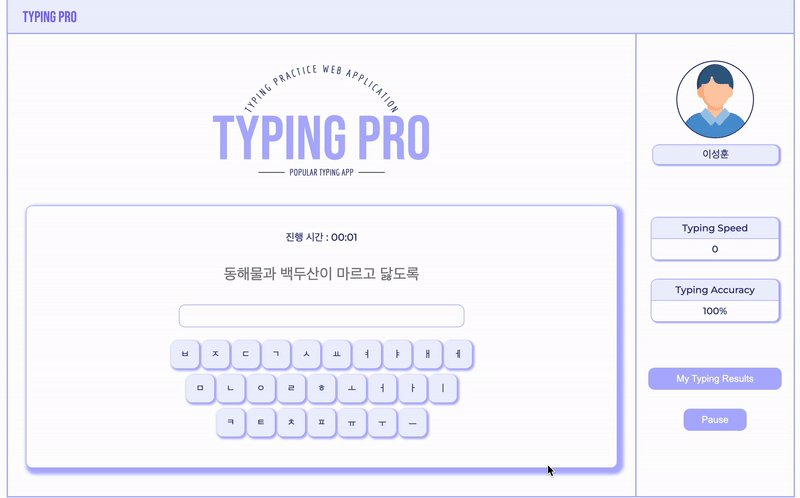
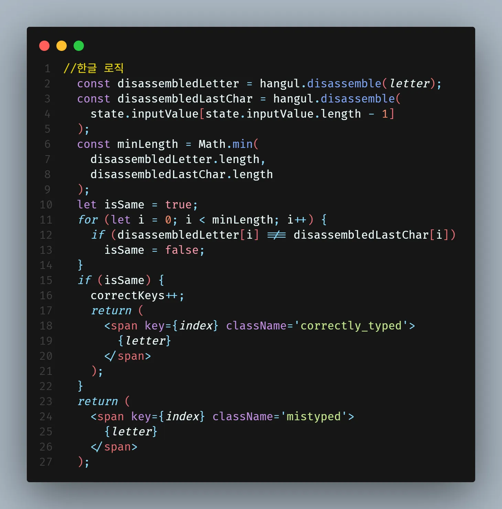
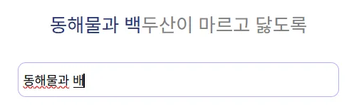
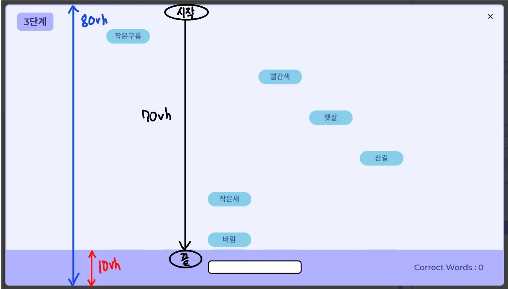
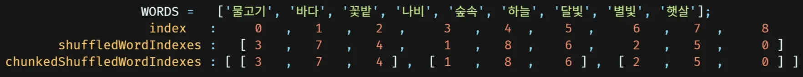
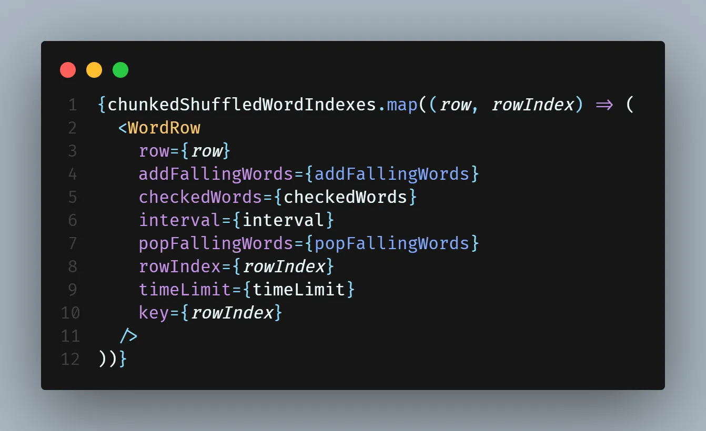
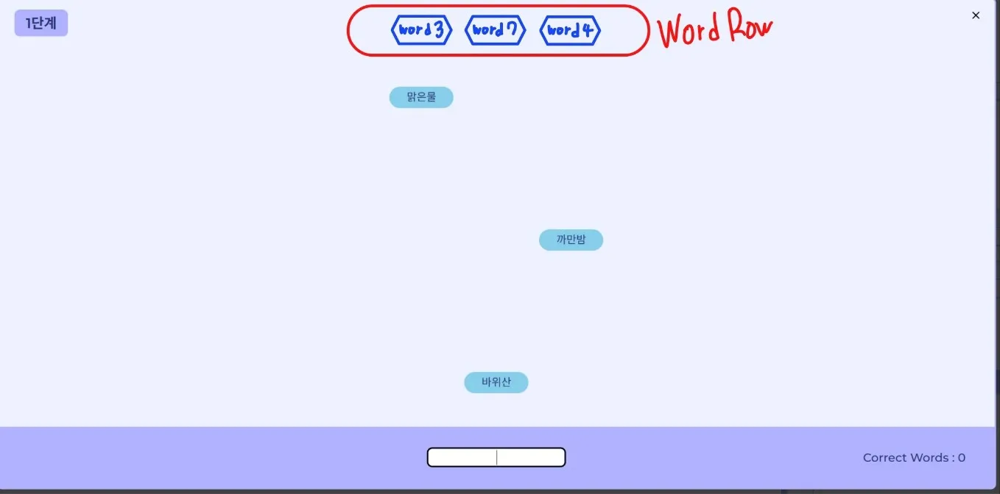
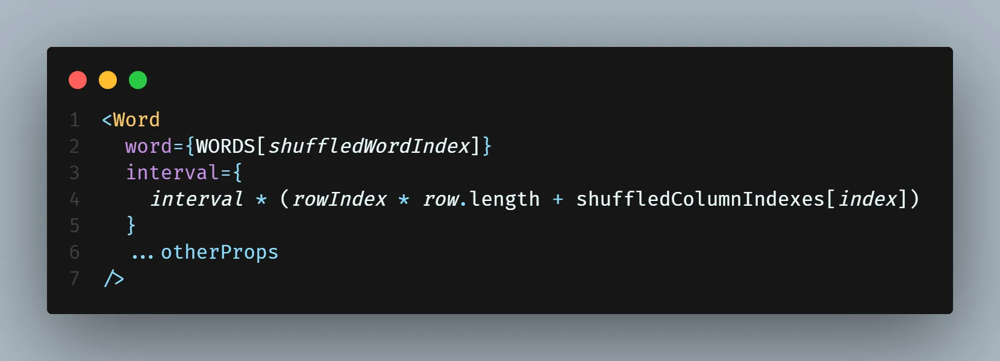
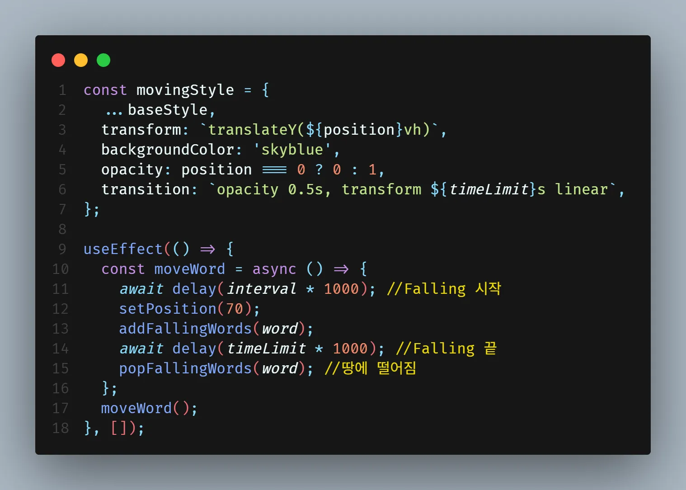

import Shower from './shower.mp4';

- 배포 URL : https://typing-pro-sigma.vercel.app/
- Github : https://github.com/shlee9999/Web_Programming_Project

## **✨ 프로젝트 개요**

---

TypingPro는 한컴타자연습에서 영감을 받아 개발된 타자 연습 웹 플랫폼입니다. DB와 백엔드 의존성을 제거하고 로그인 절차가 없어 누구나 즉시 타자 연습을 시작할 수 있으며 기록은 로컬 스토리지에 저장됩니다. 떨어지는 단어를 제한 시간 내에 입력해야 하는 게임 요소도 도입하여 재미와 도전 의식을 더해보았습니다.

## **⏰ 개발 기간**

---

2023.04 ~ 2023.06

## **🛠️ 채택한 개발 기술**

---

- React
- JavaScript
- HTML
- CSS

## **👪 팀원 구성**

---

- 이성훈(팀장)
- 김민정
- 한수정

## **🏆 기여한 내용**

- **TypingPro** 브랜드명 지음
- 플랫폼 디자인 및 로고 제작
- 키보드 UI 설계 및 핵심 로직 구현
- **소나기** 타자 게임 개발

## **🌈 담당했던 핵심 기능**

---

### **VirtualKeyboard 구현**

가상 키보드 인터페이스를 구현하여 사용자의 키 입력에 따라 동적으로 키 색상을 변경하고, 오타 발생 시 해당 글자를 빨간색으로 표시하는 실시간 피드백 시스템을 개발했습니다. 특히 한글과 같은 조합형 문자의 경우, 키 입력 횟수와 실제 글자 수가 다른 특성을 고려하여 hangul-js 라이브러리를 활용해 자소 단위로 분해 및 비교하는 정교한 로직을 구현함으로써, 영어와 한글 모두에 대해 정확한 타이핑 검사가 가능하도록 했습니다.

예를 들어, '한글'이라는 단어를 타이핑할 때

1. '한'을 입력하려면 'ㅎ', 'ㅏ', 'ㄴ'의 세 번의 키 입력이 필요합니다.
2. '글'을 입력하려면 'ㄱ', 'ㅡ', 'ㄹ'의 세 번의 키 입력이 필요합니다.

따라서 '한글'이라는 두 글자를 입력하기 위해서는 총 여섯 번의 키 입력이 필요합니다. 이는 영어와 같은 알파벳 문자와는 다른 한글만의 특징으로, 한글의 실시간 타이핑 검사를 위해서는 자소 단위의 분해와 비교가 필수적입니다.

더불어 음절 완성 이전 단계에서도 실시간으로 정확도와 타수를 계산함으로써, 사용자에게 더욱 직관적이고 상세한 피드백을 제공하여 전반적인 사용자 경험을 크게 향상시켰습니다.

**한글 실시간 타이핑 검사 로직 살펴보기**

1. 자소 분해
   - 사용자가 입력한 마지막 글자를 hangul-js 라이브러리의 disassemble API를 사용하여 자소 단위로 분해합니다.
   - 예: "백"을 입력하면 ["ㅂ","ㅐ","ㄱ"] 배열로 반환됩니다.
2. 순차적 비교
   - 분해된 자소들을 순차적으로 비교하여 현재까지의 입력 정확성을 판단합니다.
   - 이 과정을 통해 음절이 완성되기 전 단계에서도 정확한 피드백을 제공할 수 있습니다.
3. 시각적 피드백
   - 비교 결과에 따라 적절한 스타일 클래스가 적용된 span 요소를 생성합니다.
   - 이를 통해 사용자의 타이핑 상태가 실시간으로 시각적 피드백과 함께 업데이트됩니다.

위 과정을 통해 타이핑의 정확도를 세밀하게 평가할 수 있습니다.

예를 들어, 위처럼 "백"이라는 글자를 입력할 때, 일반적인 방식으로는 "백" 음절이 완성될 때까지 오타로 간주됩니다. 하지만 자소 단위 검사를 적용하면 "배"까지 입력한 상태에서도 현재까지의 타이핑이 정확하다고 인식하여 사용자에게 즉각적이고 정확한 피드백을 제공할 수 있습니다.

### 소나기 게임

<video controls width='100%'>
  <source src={Shower} />
</video>

타 라이브러리에 의존하지 않고 CSS와 React 훅만을 이용해 한컴타자연습의 산성비를 모티브로 한 소나기 게임을 구현하였습니다.

**소나기 게임 구현 사항 살펴보기**

**1. UI 설계**

소나기 창의 높이를 80vh, 경계선을 바닥으로부터 10vh로 지정하여 Word 컴포넌트가 애니메이션으로 이동하는 거리가 70vh가 되도록 설계하였습니다.

**2. 최대한 다양한 위치에서 무작위로 단어가 내려오도록 설계**

- 무작위로 단어가 내려오도록 하기 위해 우선 단어 배열의 인덱스를 섞는 과정
  하단 이미지를 참고하시면 이해하기 수월하실 겁니다. (코드가 아니라 그림이라고 생각해주세요)

  

  1. 정적 단어 배열 WORDS가 있고, WORDS의 인덱스를 섞은 배열 shuffledWordIndexes 생성 2. shuffledWordIndexes 배열을 column 개수(3)를 기준으로 row 단위로 나누어 chunkedShuffledWordIndexes 배열 생성

- chunkedShuffledWordIndexes 배열을 이용해 WordRow 렌더링
  

  1.  CSS를 통해 WordRow를 빨간색으로 표시한 곳에 겹치게 배치합니다.
      

  2.  이때 WordRow에서도 Word에 interval을 랜덤으로 섞어서 넘겨주어야 Word 컴포넌트가 왼쪽부터 순서대로 내려오지 않고 랜덤으로 내려옵니다. 열에 대한 인덱스를 섞어주기 위해 shuffledColumnIndexes를 만들고, interval에 반영합니다.
      

- Word 컴포넌트는 렌더링 시 interval만큼 기다린 이후 setPosition(70) 함수를 실행하며, position 상태에 따라 컴포넌트가 이동하도록 movingStyle 객체와 useEffect 훅을 다음과 같이 설계하였습니다.
  (Word 컴포넌트 일부)
  

이로써 Word 컴포넌트는 한 Row가 전부 서로 다른 Column에서 내려오고 다음 Row가 내려와, 시각적으로 다양한 곳에서 Word 컴포넌트가 내려올 수 있게 됩니다.

## **✍️ 배운 점**

- Git/Github로 협업 능력이 향상되었습니다.
- Javascript, React 문법에 충분히 익숙해졌습니다.
- Context API의 개념을 이해하고 실제 프로젝트에 적용해보았습니다.
- 키보드 관련 로직 구현을 통해 문제 해결 능력이 향상되었습니다.
- 자바스크립트 이벤트 루프와 비동기 함수 처리에 대해 경험해 볼 수 있었습니다.

## 🤔 아쉬운 점

- 반응형 디자인을 하지 못했지만, Planmate 프로젝트에서 경험할 수 있었습니다.
- 이슈 트래킹을 하지 못해 체계적인 협업 경험을 해보고 싶습니다.
- JavaScript에 대한 깊은 지식이 필요하다는 것을 인지했습니다.
  - 프로그래머스 데브코스에서 모던 자바스크립트 딥 다이브 스터디에 참여하여 개선했습니다.
