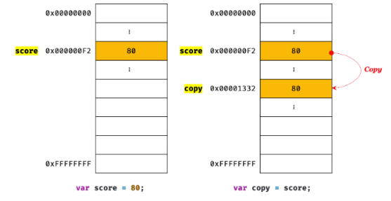

# 값에 의한 전달에 관한 고찰

> “값에 의한 전달”도 사실은 값을 전달하는 것이 아니라 메모리 주소를 전달한다. - p.145

> 결국 “값에 의한 전달”과 “참조에 의한 전달”은 식별자가 기억하는 메모리 공간에 저장되어 있는 값을 복사해 전달한다는 면에서 동일하다. 다만 식별자가 기억하는 메모리공간, 즉 변수에 저장되어 있는 값이 원시 값이냐 참조 값이냐의 차이만 있을 뿐이다. 자바스크립트에는 “참조에 의한 전달” 은 존재하지 않고 “값에 의한 전달”만이 존재한다고 말할 수 있다. - p.152

# 값에 의한 전달

자바스크립트에는 사실상 참조에 의한 전달은 없고, 값에 의한 전달만이 존재한다고 합니다. 이를 이해하기 위해 한 번 생각해보았습니다. 우리는 보통 원시값을 복사하는 경우 새로운 메모리 주소에 원시값을 저장하고 이를 전달하는 것이 일반적이라 생각하고, 한 식별자에 저장된 객체를 또다른 식별자에 할당할 때 참조값이 전달되는 게 특별한 경우라고 생각하고 있습니다. 그렇지 않나요? 하지만 이 글에서 저는 반대의 관점으로 생각해보았습니다. 모던 자바스크립트 딥 다이브 책에 적힌 설명과 그림을 계속 해서 다시 이해해본 결과 자바스크립트는 원시값을 전달할 때나 참조값을 전달할 때나 동일하게 메모리 주소를 전달합니다. 즉, 자바스크립트에 포인터는 없지만 사실 모든 게 포인터였던 것이죠. 그 값을 읽어내는 과정이 원시값이냐 참조값이냐에 따라 다를 뿐이라 생각합니다. 변수를 참조하는 방식이 자바스크립트의 경우는 전달받은 값의 메모리 주소를 읽고 `그 메모리 주소에 해당하는 값`을 읽습니다. 원시값의 경우는 이 값을 바로 읽어내지만, 객체의 경우는 `그 메모리 주소에 해당하는 값` 이 또다른 메모리 주소(참조값)입니다. 이는 객체를 저장하는 방식과 관련이 있습니다.

[스택과 힙 메모리](https://www.notion.so/9eff309f2f374f3b86557ff67a82a1d1?pvs=21)

### 원시값의 리터럴 할당 및 변수 할당

1. 리터럴 할당 `const score = 80`
   1. 새로운 메모리 공간(0x000000F2)을 확보하고 해당 메모리 공간(0x000000F2)에 값(80)을 저장합니다.
2. 변수 할당 `const copy = score`
   1. 새로운 메모리 공간(0x00001332)을 확보합니다.
   2. score에 저장된 메모리 공간(0x000000F2)의 값(80)을 메모리(0x00001332) 공간에 저장합니다.



하지만 객체의 경우는 다릅니다.

1. 리터럴 할당 `const person = { name: "Lee" }`

   1. 새로운 메모리 공간1(0x00001332)을 확보합니다.
   2. 메모리(0x00001332) 공간에 값(객체의 정보 - 프로퍼티, 메서드)을 저장합니다.
   3. 새로운 메모리 공간2(0x000000F2)을 확보합니다.
   4. 해당 메모리 공간에 메모리 주소(0x00001332) 자체인 참조값을 저장합니다.
   5. 메모리 주소(0x000000F2)를 식별자(person)에 저장합니다.

   

2. 변수 할당 `const copy = person;`
   1. person에 저장된 메모리 주소(0x000000F2)를 copy에 복사합니다.

<aside>
❓

[자바스크립트 객체는 왜 메모리를 두 번 거쳐서 저장할까?](https://www.notion.so/9728e2f515724acda76cf0948537d5a8?pvs=21)

</aside>

```jsx
// 원시값
const score = 80; // 0x000000F2: 80
const copyScore = score; // 0x00001332: 80

// 객체(참조값)
const person = { name: 'Lee' }; // 0x000000F2: 0x00001332: { name: "Lee" }
const copy = person; // 0x000000F2 0x00001332: { name: "Lee" }
```

어느 것이 더 특별한 경우로 보이시나요? 🙂

원시값의 복사가 더 복잡하고, 특별한 경우로 보인다는 관점에서 이 글을 써보았습니다.

~~아마도 메모리를 참조할 때 메모리 공간의 값이 원시값이면 그대로 반환되고, 참조값이면 참조를 쭉 타고 가도록 재귀적으로 설계된 것 같습니다.~~
