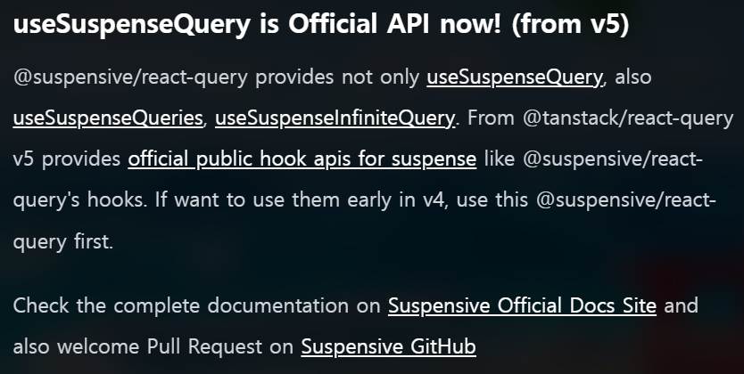
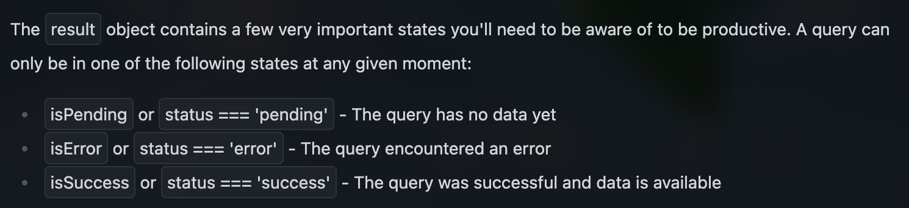
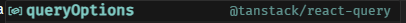

# 6. useQuery vs useSuspensQuery (React Query v5)

import Video1 from './1.mov';
import Video2 from './2.mov';

## 개요

리액트 개발자라면 자주 사용하는 @tanstack/react-query 라이브러리의 useQuery와 useSuspenseQuery의 차이점에 대해 이 글에서 간단하게 정리해보고자 합니다.

[공식문서 링크](https://tanstack.com/query/v5/docs/framework/react/reference/useSuspenseQuery)

## useSuspenseQuery는 무엇이며 왜 탄생하게 되었는가?

useQuery는 로딩 상태를 내부적으로 관리하는 방식 때문에 React의 Suspense와 완벽하게 호환되지 않는다고 합니다. 그래서 Suspense와 더 나은 호환성을 보여주는 useSuspenseQuery가 탄생합니다. Suspense는 초기 데이터 로딩 상태를 **선언적**으로 처리할 수 있게 해주어, 개발자가 로딩 상태 처리의 세부 구현보다 비즈니스 로직에 집중할 수 있게 해줍니다.

React Query v5에서 나온 최신 문법이며, 이전 버전(v4 이하)에서는 useQuery의 suspense 옵션을 true로 설정해 사용했습니다.



## Status 비교

useQuery는 data 상태에 따라 `pending`, `success`, `error` 3가지 status를 가집니다.



반면 useSuspenseQuery에는 data가 항상 존재한다고 간주하여 `success` 상태만 존재합니다. 그래서 useSuspenseQuery를 사용하는 컴포넌트는 항상 `Suspense`와 `ErrorBoundary`로 감싸주어 로딩 및 에러 상태일 때 띄워줄 UI를 명시해야 안정적으로 사용할 수 있어요.

## 기본 형태 비교

### useQuery 기본 형태

```tsx
import { useQuery } from '@tanstack/react-query';
import { fetchJsonPlaceholder } from '../apis/fetchJsonPlaceholder';

export default function UseQuery() {
  const { data, isPending, isError } = useQuery({
    queryKey: ['useQueryKey'],
    queryFn: fetchJsonPlaceholder,
  });

  if (isPending) return <div>isPending...</div>;
  if (isError) return <div>Error fetching data with useQuery!</div>;
  return (
    <div>
      <p>data fetched by "useQuery" : {JSON.stringify(data)}</p>
    </div>
  );
}
```

위처럼 `isPending`, `isError` 상태 처리를 통해 fallback을 렌더링하게 되면 컴포넌트 자체에 집중을 하기 어렵다는 단점이 있습니다.

> TypeScript - `isPending`, `isError`를 통한 early return으로 data의 `type narrowing이 가능`합니다.

### useSuspense 기본 형태

```tsx
import { useSuspenseQuery } from '@tanstack/react-query';
import { fetchJsonPlaceholder } from '../apis/fetchJsonPlaceholder';

export default function UseSuspenseQuery() {
  const { data } = useSuspenseQuery({
    queryKey: ['useSuspenseQueryKey'],
    queryFn: fetchJsonPlaceholder,
  });

  return (
    <div>
      <p>data fetched by "useSuspenseQuery" : {JSON.stringify(data)}</p>
    </div>
  );
}
```

상태처리 없이 바로 컴포넌트에 대한 비즈니스 로직과 UI를 작성하면 되므로 컴포넌트 자체에 집중을 하기 좋고 로직이 간결합니다. 다만, 부모 컴포넌트에서 `Suspense`와 `ErrorBoundary`로 감싸주어야 하는 작업이 필요합니다.

## 함께 써서 비교해보기

```tsx
// App.tsx
import { Suspense } from 'react';
import UseQuery from './components/UseQuery';
import { ErrorBoundary } from 'react-error-boundary';
import UseSuspenseQuery from './components/UseSuspenseQuery';

function App() {
  return (
    <div>
      <UseQuery />
      <ErrorBoundary FallbackComponent={ErrorFallback}>
        <Suspense fallback={<div>UseSuspenseQuery Loading...</div>}>
          <UseSuspenseQuery />
        </Suspense>
      </ErrorBoundary>
    </div>
  );
}

function ErrorFallback() {
  return <div>Error!!</div>;
}

export default App;
```

위와 같이 두 컴포넌트를 모두 렌더링 해보았습니다. 앞서 말씀드렸듯이 부모 컴포넌트에서 useSuspenseQuery를 사용한 컴포넌트는 `Suspense`와 `ErrorBoundary`로 감싸주었습니다.

### No Error

<video controls width='100%'>
  <source src={Video1} />
</video>

### Error

<video controls width='100%'>
  <source src={Video2} />
</video>

두 컴포넌트 모두 의도한 대로 잘 작동하는 모습을 볼 수 있습니다.

## options

useQuery와 useSuspense는 대부분의 옵션을 공유하지만, useSuspense의 경우 다음 3가지 옵션들이 제외됩니다.

- `throwOnError`
- `enabled`
- `placeholderData`

## queryOptions

queryOptions 함수를 `@tanstack/react-query`에서 지원합니다. typescript에서 queryOptions를 분리하고 싶을 때 타입에 대한 힌트를 제공해주기 위하여 존재합니다. 다음과 같이 사용합니다.

```jsx
const options = queryOptions({
  queryKey: ['useQueryKey'],
  queryFn: fetchJsonPlaceholder,
});

const { data, isPending, isError } = useQuery(options);
```


